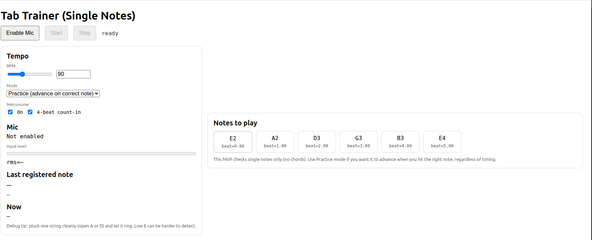

# 🎸 Guitar Tab Trainer (Monophonic, Web-Based)

A **web-based guitar practice app** inspired by Yousician-style exercises.  
PROD-8: Test a guitar training app with tablatures based on youcisian  


Instead of reading tablature visually, you **play your guitar**, and the app listens through your microphone and checks whether you played the **correct note**, optionally **in time**.

This project focuses on:
- single-note practice (no chords yet)
- slow practice with a metronome
- clear audio-based feedback
- running entirely in the browser

No plugins. No native apps. Just your browser and a microphone.

---

## ✨ Features

- 🎤 Live microphone input (Web Audio API)
- 🎵 Robust pitch detection (YIN algorithm)
- 🧠 Octave correction (handles harmonics / octave errors)
- ⏱ Practice mode – advance when the correct note is played
- 🥁 Rhythm mode – must hit notes within a timing window
- 🔊 Built-in metronome with optional count-in
- 🐳 Dockerized (easy to run, no local toolchain required)

---

## 🚧 Current limitations (by design)

- Monophonic only (one note at a time)
- No chord detection
- No string/fret identification (pitch-based, not position-based)
- Best results with **headphones** (to avoid mic feedback)

These are conscious MVP choices, not technical dead ends.

---

## 🧩 How it works (high level)

1. The browser captures audio via `getUserMedia`
2. Audio is analyzed in real time using the Web Audio API
3. Pitch is detected using the **YIN** algorithm
4. Detected pitch is:
   - stabilized across frames
   - octave-corrected against the expected tab note
5. The result is matched against the current exercise step
6. Feedback is shown and (optionally) enforced by timing rules

The microphone hears **pitch**, not finger positions — so the app validates **what you played**, not *how* you played it.

---

## 🐳 Build & Run (Docker – recommended)

### Requirements

- Docker (recent version)
- A browser with microphone access (Chrome, Firefox, Safari)

### Build the image

```bash
docker build -t guitar-tab-trainer .
```

### Run the container 

```bash
docker run --rm -p 8080:8080 guitar-tab-trainer
```

### Open the app

[http://localhost:8080](http://localhost:8080)

## How to use

1. Click Enable Mic and allow microphone access
2. (Strongly recommended) Use headphones
3. Choose a mode:
   - Practice mode → advance when the correct note is played
   - Rhythm mode → must hit within a timing window
4. Set BPM (slower is better for practice)
5. Click Start
6. Play single notes cleanly (open strings work well)

## Tips for best results

- Use headphones (prevents metronome feedback into the mic)
- Pluck one string at a time
- Let the note ring briefly
- Start with open A or D strings (easier to detect than low E)
- Avoid background talking near the microphone

## About AI assistance

This project was created with the help of Large Language Models (LLMs).
In particular:

- ChatGPT was used as a development assistant
- to reason about audio DSP concepts
- to prototype pitch detection logic
- to design the overall architecture
- and to iteratively debug and refine the system
- All final design decisions, implementation, integration, and validation were performed by the human developer.


